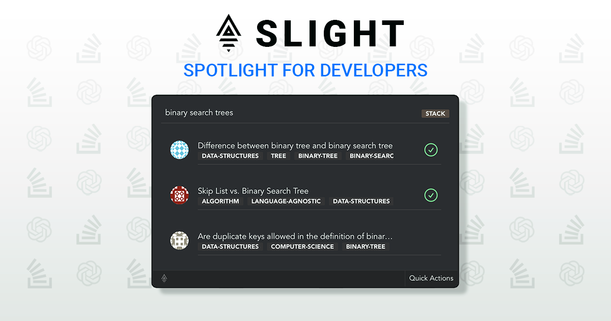

Slight is a lightweight and blazingly fast launcher for developers to quickly search Stack-Overflow questions, and receive additional help from ChatGPT. ⚡

🚧 Slight is in early development stages, bugs are expected. If you are interested in getting involved and making a positive impact on this exciting project, we welcome your participation.

---

## 📥 Downloading

To download Slight, visit the [releases section](https://github.com/Syntad/slight/releases) of the project's repository on GitHub. There, you will find the latest version of the app available for download for all major OS versions. Simply click on the download link and follow the prompts to install the app on your computer.

📌 It's worth noting that the default shortcut for opening Slight on MAC is `CMD + K` and for Windows it's `CONTROL + SHIFT + K`, and this can be changed from the preferences section within the app. This allows you to customize the app to your specific needs and preferences, making it even more convenient and easy to use.

## 🛠 Upcoming Features

-   [ ] ChatGPT support
-   [ ] Git tooling
    -   Notifications
    -   Contributions
-   [ ] Theming

If you have any suggestions, feel free to conact us.

## 🤝 Contributing

To get Slight set up on your machine, you'll need to have Rust, smake, and pnpm (or a package manager of your choice) installed. Then, follow these steps:

Installs:

-   Rust: `https://www.rust-lang.org/tools/install`
-   Smake: `https://github.com/Syntad/smake`
-   PNPM: `https://pnpm.io/installation`

---

1. Clone the project using `git clone https://github.com/Syntad/slight.git`
2. Change into the project directory: `cd slight`
3. Setup project and install dependencies: `smake -i`
4. Run the development server: `smake run`

If you encounter any issues, try running `smake -b` after installing dependencies.

## 📝 License

Slight is licensed under the MIT LICENSE. See the [LICENSE file](./LICENSE.txt) for more information.
